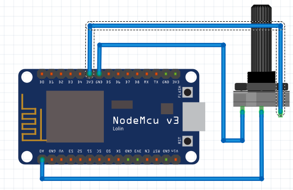

Real Time IoT in the cloud with SAP HCP, Cloud Foundry and WebSockets 
======

Nowadays I'm involved with a project based on SAP's Hana Cloud Platform (HCP). Side projects are the best way to mastering new technologies (at least for me) so I want to build something with my arduino stuff. HCP comes whit one IT module. Every cloud platforms have, in one way or another, one IoT module. With HCP the IoT module it's a Hana Database where we can push our IoT values and we're able to retrieve information via oData (the common way with SAP). 

It's pretty straightforward to configure the IoT module with the SAP Cloud Platform Cockpit. Every thing can be done with a hana trial account (account.hana.ondemand.com).

## NodeMcu

I'm going to use a simple circuit with my NodeMcu connected to my wifi network. The prototype is a potentiometer connected to the analog input. 



It will send the percentage (from 0 to 100) of the position of the potentiometer to the cloud. 

```c
#include <ESP8266WiFi.h>

const int potentiometerPin = 0;

// Wifi configuration
const char* ssid = "my-wifi-ssid";
const char* password = "my-wifi-password";

// SAP HCP specific configuration
const char* host = "mytenant.hanatrial.ondemand.com";
String device_id = "my-device-ide";
String message_type_id = "my-device-type-id";
String oauth_token = "my-oauth-token";

String url = "https://[mytenant].hanatrial.ondemand.com/com.sap.iotservices.mms/v1/api/http/data/" + device_id;

const int httpsPort = 443;

WiFiClientSecure clientTLS;

void wifiConnect() {
  Serial.println();
  Serial.print("Connecting to ");
  Serial.println(ssid);

  WiFi.begin(ssid, password);

  while (WiFi.status() != WL_CONNECTED) {
    delay(500);
    Serial.print(".");
  }
  Serial.println("");
  Serial.print("WiFi connected.");
  Serial.print("IP address: ");
  Serial.println(WiFi.localIP());
}

void sendMessage(int value) {
  String payload = "{\"mode\":\"async\", \"messageType\":\"" + message_type_id + "\", \"messages\":[{\"value\": " + (String) value + "}]}";
  Serial.print("connecting to ");
  Serial.println(host);
  if (!clientTLS.connect(host, httpsPort)) {
    Serial.println("connection failed");
    return;
  }

  Serial.print("requesting payload: ");
  Serial.println(url);

  clientTLS.print(String("POST ") + url + " HTTP/1.0\r\n" +
               "Host: " + host + "\r\n" +
               "Content-Type: application/json;charset=utf-8\r\n" +
               "Authorization: Bearer " + oauth_token + "\r\n" +
               "Content-Length: " + payload.length() + "\r\n\r\n" +
               payload + "\r\n\r\n");

  Serial.println("request sent");

  Serial.println("reply was:");
  while (clientTLS.connected()) {
    String line = clientTLS.readStringUntil('\n');
    Serial.println(line);
  }
}

void setup() {
  Serial.begin(9600);
  wifiConnect();

  delay(10);
}

int mem;
void loop() {

  int value = ((analogRead(potentiometerPin) * 100) / 1010);
  if (value < (mem - 1) or value > (mem + 1)) {
    sendMessage(value);
    Serial.println(value);
    mem = value;
  }

  delay(200);
}
```

### HCP

Hana Cloud Platform allow us to create web application using SAPUI5 easily. It also allow us to create a destination (the way that SAP uses to connect modules) to our IoT module. Also every Hana table can be accessed via oData and we can retrieve the information easily within SAPIUI5

```js
onAfterRendering: function () {
    var model = this.model;

    this.getView().getModel().read("/my-hana-table-odata-uri", {
        urlParameters: {
            $top: 1,
            $orderby: "G_CREATED desc"
        },
        success: function (oData) {
            model.setProperty("/value", oData.results[0].C_VALUE);
        }
    });
}
```

and display in a view
```xml
<mvc:View controllerName="gonzalo123.iot.controller.Main" xmlns:html="http://www.w3.org/1999/xhtml" xmlns:mvc="sap.ui.core.mvc"
          displayBlock="true" xmlns="sap.m">
    <App>
        <pages>
            <Page title="{i18n>title}">
                <content>
                    <GenericTile class="sapUiTinyMarginBegin sapUiTinyMarginTop tileLayout" header="nodemcu" frameType="OneByOne">
                        <tileContent>
                            <TileContent unit="%">
                                <content>
                                    <NumericContent value="{view>/value}" icon="sap-icon://line-charts"/>
                                </content>
                            </TileContent>
                        </tileContent>
                    </GenericTile>
                </content>
            </Page>
        </pages>
    </App>
</mvc:View>
```

## Cloud Foundry

The web application (with HCP and SAPUI5) can access to IoT values via oData. We can fetch data again and again, but that's not cool. We want real time updates in the web application. So we need WebSockets. HCP IoT module allow us to us WebSockets to put information, but not get updates. We can connect our IoT to a MQTT server, but here I only want device's uptades. So we're going to create a siple WebSocket server with node and socket.io. This server will be listening to devices updates (again and again with a setInterval) and when it detects a change will emit a broadcast to the WebSocket.

SAP's HCP also allows us to create services with Cloud Foundry. So we'll create our nodejs server here

```js
var http = require('http'),
    io = require('socket.io'),
    request = require('request'),
    auth = "Basic " + new Buffer(process.env.USER + ":" + process.env.PASS).toString("base64"),
    url = process.env.IOT_ODATA,
    INTERVAL = process.env.INTERVAL,
    socket,
    value;

server = http.createServer();
server.listen(process.env.PORT || 3000);

socket = io.listen(server);

setInterval(function () {
    request.get({
        url: url,
        headers: {
            "Authorization": auth,
            "Accept": "application/json"
        }
    }, function (error, response, body) {
        var newValue = JSON.parse(body).d.results[0].C_VALUE;
        if (value !== newValue) {
            value = newValue;
            socket.sockets.emit('value', value);
        }
    });
}, INTERVAL);
```

And that's all. My NodeMcu device connected to the cloud.